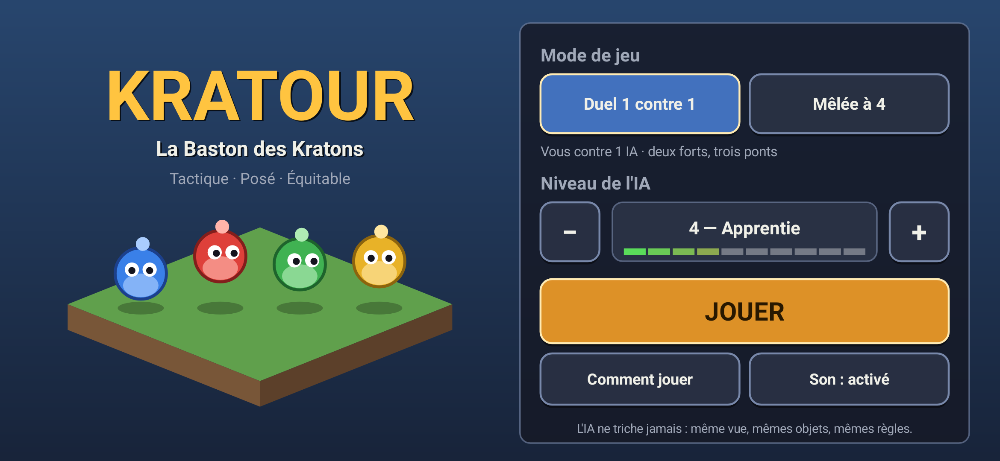
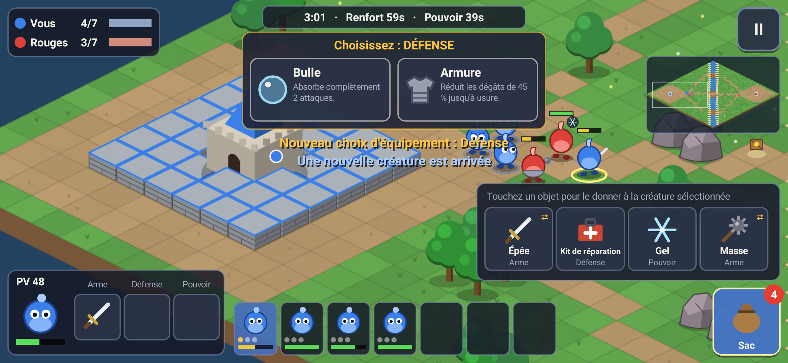

# Kratour — La Baston des Kratons

Jeu Android de stratégie tactique en temps réel, posé et équitable, inspiré du fonctionnement d'un mode « baston » à la Gruntz, avec un univers original : les **Kratons**, petites créatures-galets qui s'affrontent autour de forts de briques.




## Règles en bref

- Chaque équipe commence avec **3 Kratons nus**, tous identiques (100 PV, même vitesse, mêmes poings).
- Toutes les **60 s**, une nouvelle créature nue apparaît près du fort si l'équipe en a moins de **7 vivantes**.
- Toutes les **40 s**, **toutes les équipes reçoivent le même choix** entre deux objets (Arme → Défense → Pouvoir → …). Chacun choisit de son côté ; l'objet va dans le **sac commun**, puis on le donne à la créature de son choix.
- Une créature porte au plus **1 arme, 1 défense, 1 pouvoir**. À sa mort, **tout tombe au sol**, récupérable par n'importe qui (on lâche l'objet de même type qu'on portait).
- **Victoire** : casser l'enceinte de briques d'un fort ennemi et **faire entrer une créature dedans** — son équipe est éliminée sur-le-champ. Pas de chrono, pas de barre de capture.
- Pas de tir ami. Une créature attaquée **riposte seule** ; un ordre de déplacement reste prioritaire (retraite).

| Armes | Défenses | Pouvoirs |
|---|---|---|
| Épée (rapide, polyvalente) | Bouclier (bloque 6 coups **de face**) | Soin (+50 PV) |
| Masse (lente, gros dégâts, repousse) | Armure (−45 % de dégâts jusqu'à usure) | Vitesse (+60 %, 12 s) |
| Lance (portée 2) | Bulle (absorbe 2 attaques) | Force (+50 % dégâts, 12 s) |
| Marteau (démolisseur de briques) | Kit de réparation (reconstruit 3 briques) | Onde de choc (repousse + étourdit) |
| Arbalète (6 carreaux, portée 6) | Barricade (2 obstacles temporaires) | Gel (immobilise 3,5 s) |
| Bombe (2 bombes, zone, ravage les briques) | | Invisibilité (10 s, annulée en attaquant) |

Bonus neutres sur la carte (réapparaissent) : petite potion, recharge de munitions, plume de hâte.

## Cartes

- **La Rivière Fendue (1 contre 1)** — symétrie centrale exacte, une rivière et **trois ponts** (aucun passage unique ne bloque la partie).
- **Le Carrefour des Quatre (4 équipes)** — symétrie de rotation d'ordre 4 exacte ; quatre forts dans les coins, place centrale, ruisseaux à ponts entre voisins. Les **3 IA sont indépendantes** et se battent aussi entre elles.

La symétrie et la connectivité sont vérifiées par des tests automatiques.

## IA : 10 niveaux, aucune triche

L'IA ne voit le monde qu'à travers `TeamView` : exactement ce que voit un joueur (pas d'ennemis invisibles, pas des sacs ni des choix adverses, pas des munitions ennemies) et agit avec les **mêmes commandes**. Le niveau ne change que la qualité des décisions : vitesse de réaction, nombre d'unités gérées à la fois, choix et répartition des objets, défense, focalisation des tirs, repli des blessés, ramassage du butin, kiting à l'arbalète, diversion par une seconde brèche, opportunisme en partie à 4…

## Contrôles

Toucher une créature = la sélectionner · toucher une case = s'y rendre (et ramasser) · toucher un ennemi / une brique = attaquer · glisser = déplacer la vue · pincer = zoomer · mini-carte · barre des créatures en bas · sac commun en bas à droite · bouton « Utiliser » sur la fiche pour pouvoirs, bombes, kit et barricade.

## Architecture

- `core/` — moteur pur Kotlin/JVM, sans dépendance Android : règles, cartes, pathfinding A*, IA, simulation à pas fixe (20 Hz). Entièrement testé (`./gradlew :core:test`), y compris des parties complètes IA contre IA.
- `app/` — application Android légère : une seule `View` accélérée matériellement, rendu isométrique 2.5D (terrain pré-rendu, sprites générés par le code, tri en profondeur), interface tactile, sons **synthétisés** au lancement. Aucune image ni son externe, aucune bibliothèque tierce.

## Compiler

```bash
./gradlew :app:assembleDebug        # APK dans app/build/outputs/apk/debug/
./gradlew :core:test                # tests du moteur
```

Ou ouvrir le dossier dans Android Studio. La CI GitHub Actions (`.github/workflows/android.yml`) lance les tests et publie l'APK en artefact.

`tools/local-check/` contient une vérification hors Android Gradle Plugin (compilation contre `android.jar`, assemblage d'un APK avec les outils Debian, captures d'écran via Robolectric) utilisée pendant le développement.

## Équilibrage

Les valeurs sont centralisées dans `core/.../Balance.kt` et `Items.kt` (briques 900 PV, pas de 0,7 s par case, etc.). Mesures en simulation IA contre IA : duels de 5 à 10 min, parties à 4 de 7 à 18 min ; un niveau 9 bat systématiquement un niveau 2.
